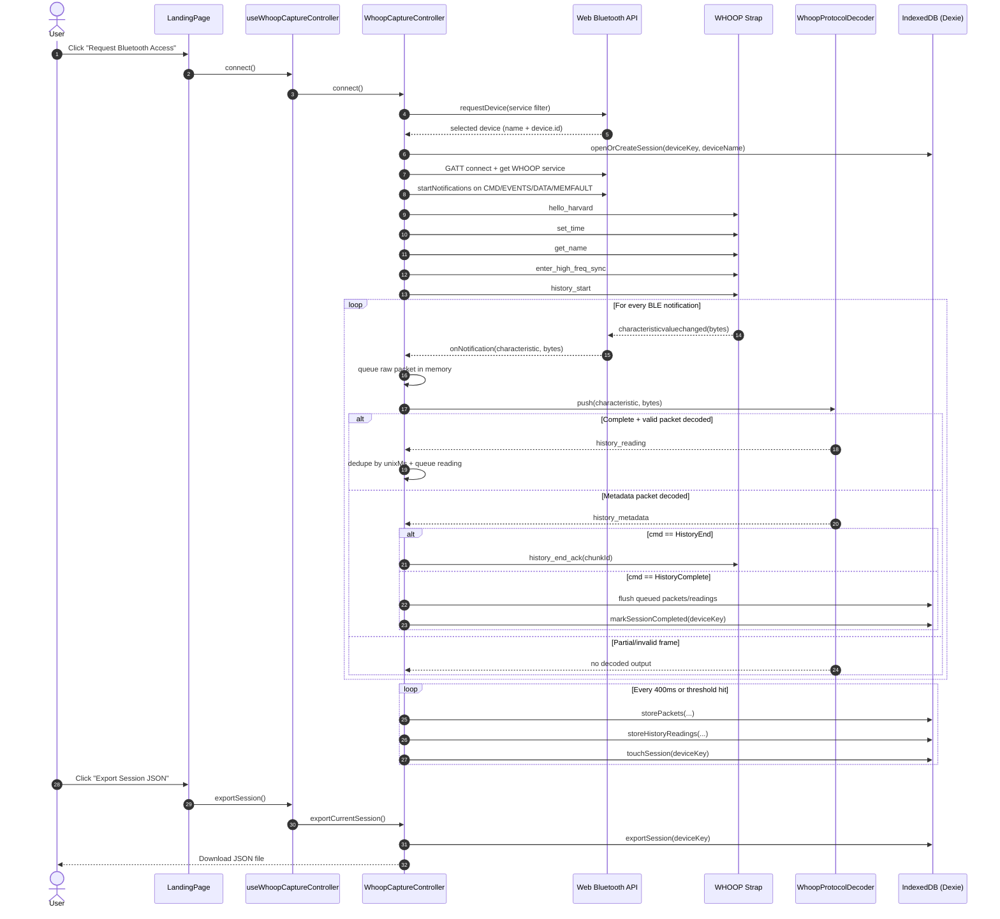

# Froop MVP: How It Works

This document explains how the `mvp` app is structured, how it communicates with a WHOOP strap over Web Bluetooth, and how raw notifications are parsed into usable data.

The focus is on runtime flow and data lifecycle (not line-by-line implementation).

## 1) What this app is

`mvp` is a React + TypeScript SPA with three pages:

- `Landing`: WHOOP capture console (Bluetooth connect, live status, packet/reading counters, export).
- `Analysis`: dashboard-style mock analytics (RTK Query with fake base query and seeded data).
- `Settings`: validated form workflow (React Hook Form + Zod).

The WHOOP integration lives in `src/features/whoop` and is independent from the dashboard mock data.

## 2) High-level architecture

At runtime, WHOOP capture is layered like this:

1. UI layer (`LandingPage`) triggers connect/resume/disconnect/export.
2. Hook layer (`useWhoopCaptureController`) exposes a single shared controller to React.
3. Orchestration layer (`WhoopCaptureController`) manages sessions, protocol state, buffering, dedupe, flush cadence, telemetry, and completion logic.
4. Transport layer (`whoop.ts`) talks to Web Bluetooth and sends WHOOP commands.
5. Decode layer (`decoder.ts`) reassembles framed packets, validates CRC, and maps bytes to domain records.
6. Persistence layer (`storage.ts`) stores sessions, raw packets, and decoded readings in IndexedDB (Dexie).

## 3) End-to-end sequence

## 4) WHOOP communication details

### 4.1 Browser/runtime requirements

Capture only runs when all are true:

- Chromium-like desktop browser.
- `navigator.bluetooth` available.
- Secure context (`https` or localhost).
- IndexedDB available.

### 4.2 Service and characteristics

WHOOP service UUID:

- `61080001-8d6d-82b8-614a-1c8cb0f8dcc6`

Characteristics used:

- Write commands to strap:
  - `CMD_TO_STRAP`: `61080002-8d6d-82b8-614a-1c8cb0f8dcc6`
- Subscribe notifications from strap:
  - `CMD_FROM_STRAP`: `61080003-8d6d-82b8-614a-1c8cb0f8dcc6`
  - `EVENTS_FROM_STRAP`: `61080004-8d6d-82b8-614a-1c8cb0f8dcc6`
  - `DATA_FROM_STRAP`: `61080005-8d6d-82b8-614a-1c8cb0f8dcc6`
  - `MEMFAULT`: `61080007-8d6d-82b8-614a-1c8cb0f8dcc6`

### 4.3 Startup command handshake

After subscribe, the app sends this command sequence with a short gap between writes:

1. `GetHelloHarvard` (`cmd=35`, payload `[0x00]`)
2. `SetClock` (`cmd=10`, payload includes current unix seconds)
3. `GetAdvertisingNameHarvard` (`cmd=76`, payload `[0x00]`)
4. `EnterHighFreqSync` (`cmd=96`, empty payload)
5. `SendHistoricalData` (`cmd=22`, payload `[0x00]`)

When WHOOP later reports `HistoryEnd`, the app acknowledges with:

- `HistoricalDataResult` (`cmd=23`) and the chunk id from metadata.

### 4.4 Command framing format

Outbound and inbound WHOOP framed packets use:

1. `SOF` = `0xAA`
2. `length` (2 bytes little-endian)
3. `header_crc8` (CRC8 over the two `length` bytes)
4. inner body:
  - `packet_type` (1 byte)
  - `seq` (1 byte)
  - `cmd` (1 byte)
  - payload bytes
  - trailing `crc32` (4 bytes over `packet_type + seq + cmd + payload`)

Frames failing CRC or shape checks are ignored.

## 5) How raw data is parsed

### 5.1 Reassembly and integrity

BLE notifications can split a single WHOOP frame across multiple events.

Decoder behavior:

1. Keep per-characteristic partial state.
2. Parse header (`SOF`, `length`, header CRC8).
3. Append incoming bytes until full frame length is reached.
4. Validate data CRC32.
5. If valid, decode packet type; otherwise drop.

### 5.2 Packet type routing

The MVP parser currently maps:

- `packet_type=49` -> metadata (`history_metadata`)
- `packet_type=47` -> historical reading (`history_reading`)

`CommandResponse` packets are currently not mapped into domain entities in this MVP decode path.

### 5.3 Historical payload variants

Decoder chooses parser by payload size + sequence/version:

1. Large IMU format (`payload >= 1188`):
   - Reads HR + RR and 100 samples for each axis:
     - Accel: `acc_x_g`, `acc_y_g`, `acc_z_g` (scaled by `1/1875`)
     - Gyro: `gyr_x_dps`, `gyr_y_dps`, `gyr_z_dps` (scaled by `1/15`)
2. V12/V24 DSP format (`payload >= 77` and `seq == 12 || seq == 24`):
   - Reads HR + RR plus sensor fields:
     - PPG (`ppg_green`, `ppg_red_ir`)
     - SpO2 (`spo2_red`, `spo2_ir`)
     - `skin_temp_raw`, `ambient_light`, `led_drive_1`, `led_drive_2`
     - `resp_rate_raw`, `signal_quality`, `skin_contact`
     - gravity vector (`accel_gravity` as 3 floats)
3. Generic format (fallback):
   - Reads timestamp, BPM, RR intervals (up to 4 slots), no extra sensor/IMU payload.

### 5.4 Metadata semantics

Metadata commands:

- `1` -> `HistoryStart`
- `2` -> `HistoryEnd`
- `3` -> `HistoryComplete`

Controller actions:

- On `HistoryEnd`: send `history_end_ack` with chunk id (`data` field).
- On `HistoryComplete`: flush remaining buffers, mark session completed.

## 6) Session, buffering, and persistence model

### 6.1 IndexedDB schema (`froop`, version 3)

Tables:

- `sessions` (`deviceKey` primary key):
  - `deviceName`, `createdAt`, `updatedAt`, `status` (`in_progress|completed`)
- `raw_packets`:
  - `deviceKey`, `characteristic`, `bytes`, `receivedAt`
- `history_readings`:
  - `deviceKey`, `version`, `unixMs`, `bpm`, `rr`, `sensor_data`, `imu_data`, `receivedAt`

### 6.2 Write strategy

To avoid writing on every notification, controller buffers in memory and flushes:

- every `400ms`, or
- immediately when either queue reaches `250` items.

On each flush:

- bulk insert queued raw packets/readings,
- update session `updatedAt` (`touchSession`).

### 6.3 Deduplication and resume behavior

- Decoded readings are deduplicated by `unixMs` in-memory.
- On resume, existing `unixMs` values are loaded from DB into the dedupe set.
- This lets resumed sessions append only unseen readings.

### 6.4 Export behavior

Export produces a single JSON payload for one `deviceKey`:

- `session`
- `packets` (raw notifications)
- `historyReadings` (decoded records)

Downloaded file name format:

- `froop-device-<deviceKey>.json`

## 7) Important operational notes

- The WHOOP session identity is based on browser-exposed `device.id` (`deviceKey`).
- If Chrome does not expose a stable Bluetooth device identifier, connection is rejected with guidance.
- The UI progress bar is a timeline coverage estimate from earliest to latest decoded timestamp; final completion is only true after `HistoryComplete`.
- `DECODE.md` in this folder describes an older Rust `openwhoop` stack and is not the active parser implementation used by this React MVP.

## 8) File map for WHOOP flow

- `src/features/whoop/whoop.ts`: Web Bluetooth transport + command framing.
- `src/features/whoop/decoder.ts`: frame reassembly, CRC checks, payload parsing.
- `src/features/whoop/storage.ts`: Dexie schema and persistence API.
- `src/features/whoop/controller/WhoopCaptureController.ts`: orchestration/state machine.
- `src/features/whoop/controller/useWhoopCaptureController.ts`: React hook bridge.
- `src/pages/LandingPage.tsx`: operator UI for capture lifecycle.

